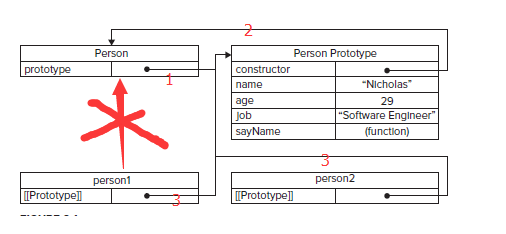
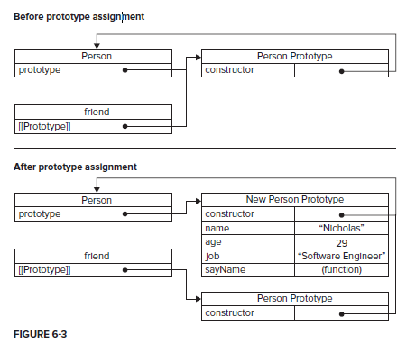
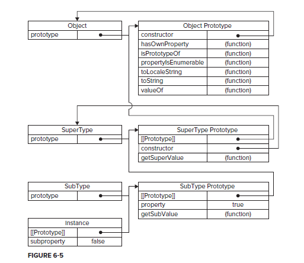

# 面向对象的程序设计(Object-Oriented Programming)

## 理解对象

创建对象最简单的方式，一种是**new Object()**,一种是使用**字面量**。

```js
var person = new Object();
person.name = "Nicholas";
person.age = 29;
person.job = "Software Engineer";
person.sayName = function(){
	alert(this.name);
};

var person = {
name: "Nicholas",
age: 29,
job: "Software Engineer",
sayName: function(){
	alert(this.name);
}
};
```

### 属性类型（Types of Properties）

包括数据属性和访问器属性

**1. 数值属性**：

- [[Configurable]]：表示能否通过delete删除属性从而重新定义属性。在使用前面两种方式创建时，默认值为true。如果是defineProperty方式，默认是false
- [[Enumerable]]：表示能否通过for-in循环返回属性。默认值为true。
- [[Writable]]：表示能否修改属性的值，默认为true。
- [[Value]]：包含这个属性的数据值。默认为undefined。


要**修改属性默认的特性**，必须使用ECMAScript5的**Object.defineProperty()方法**。接收三个参数：属性所在对象，属性名字和一个描述符对象。其中，描述符对象的属性必须是：configurable、enumerable、writable和value。

**writable表示不能修改属性的值**，如果定义了writable为false,在非严格模式下，如果尝试修改会忽略修改；在严格模式下会报错。

```js
var person = {};
Object.defineProperty(person,'name',{
    writable:false,
    value:'Nicholas'
});

alert(person.name); //"Nicholas"
person.name='Greg';
alert(person.name); //仍然是"Nicholas"，因为不可修改
```

如果在最前面加上`"use strict"`,将在运行时产生`Uncaught TypeError: Cannot assign to read only property 'name' of object '#<Object>'(…)`。的错误

对configurable也同样使用，**configurable表示不可以删除属性**，即使删除也会被忽略(非严格模式下)，严格模式下报错。

```js
var person ={};
Object.defineProperty(person,'name',{
	
    configurable:false,
    value:'bensonlin'
});

alert(person.name);
delete person.name;//删除无效
// person.name='wangye'; //修改无效
alert(person.name);
```

如果configurable为false，那么将不能再次修改为true，否则会报错，即使在非严格模式下。

```js
var person = {};
Object.defineProperty(person, "name", {
	configurable: false,
	value: "Nicholas"
});
// 报错
Object.defineProperty(person, "name", {
	configurable: true,
	value: "Nicholas"
});
```

结合上面的wrtable，如果writable为false，而configurable为true，虽然不可以修改属性(configurable为true，但是还是受wrtiable影响)，但是可以通过先删除属性再定义相同名字的属性实现变相修改属性。

```js
"use strict";
var person ={};
Object.defineProperty(person,'name',{
    writable:false,
    configurable:true,
    value:'bensonlin'
});

alert(person.name);

// person.name='wangye'; // 不要试图这样改，严格模式下会报错
delete person.name;
Object.defineProperty(person,'name',{
    configurable:true,
    value:'wangye'
});
alert(person.name);
```


**2. 访问器属性**：不包含数据值，包含一对getter和setter函数。

- [[Configurable]]：表示能否通过delete删除属性从而重新定义属性。默认值为true。
- [[Enumerable]]：表示能否通过for-in循环返回属性。默认值为true。
- [[Get]]：在读取属性时调用的函数，默认值为undefined。
- [[Set]]：在写入属性时调用的函数，默认值为undefined。

访问器属性常见的方式是设置一个属性的值会导致其他属性的变化。

```js
var book = {
	_year: 2004,
	edition: 1
};
Object.defineProperty(book, "year", {
	get: function(){
		return this._year;
	},
	set: function(newValue){
		if (newValue > 2004) {
			this._year = newValue;
			this.edition += newValue - 2004;
		}
	}
});
book.year = 2005;
alert(book.edition); //2
```

在属性前加_是表示只能通过对象方法访问的属性，当然这只是一种约定，还是能够通过`alert(book._year);`访问。如果只有getter则是只读属性，尝试写非严格模式下忽略，严格模式下报错。只有setter表示只可写，尝试读时非严格模式下返回undefined，严格模式下报错。

**3. 定义多个属性**，ECMAScript5定义了Object.defineProperties()方法。

```js
var book = {};
Object.defineProperties(book, {
	_year: {
		value: 2004
	},
	edition: {
		value: 1
	},
	year: {
		get: function(){
			return this._year;
		},
		set: function(newValue){
			if (newValue > 2004) {
				this._year = newValue;
				this.edition += newValue - 2004;
			}
		}
	}
});
```


**4. 读取属性的特性**：属性的特性指的是前面的六个属性(value,configurable,writable,enumerable,get,set)，ECMAScript5的Object.getOwnPropertyDescriptor()方法独特给定属性的描述符，从而获取value, configurable, writable等值。

```js
var descriptor = Object.getOwnPropertyDescriptor(book, "_year");
alert(descriptor.value); //2004
alert(descriptor.confi gurable); //false
alert(typeof descriptor.get); //"undefined"

var descriptor = Object.getOwnPropertyDescriptor(book, "year");
alert(descriptor.value); //undefined
alert(descriptor.enumerable); //false
alert(typeof descriptor.get); //"function"
```


## 对象的创建

几种模式：工厂模式、构造函数模式、原型模式、组合使用构造模式和原型模式、动态原型模式、寄生构造函数模式、稳妥构造函数模式


**1. 工厂模式**：

```js
function createPerson(name, age, job){
	var o = new Object();
	o.name = name;
	o.age = age;
	o.job = job;
	o.sayName = function(){
		alert(this.name);
	};
	return o;
}
var person1 = createPerson("Nicholas", 29, "Software Engineer");
var person2 = createPerson("Greg", 27, "Doctor");
```

工厂模式虽解决了多个相似对象问题，但没有解决对象识别的问题，即不知道一个对象类型。


**2. 构造函数模式**:

```js
function Person(name, age, job){
	this.name = name;
	this.age = age;
	this.job = job;
	this.sayName = function(){
		alert(this.name);
	};
}
var person1 = new Person("Nicholas", 29, "Software Engineer");
var person2 = new Person("Greg", 27, "Doctor");
```

构造函数模式在原生构造函数如Array，Object中就出现了。这里没有显式创建对象；直接将属性和方法赋给了this对象；也没有return语句。在使用new后将this分别指向person1和person2实例；

两个对象中都有一个construtor属性，该属性指向Person。但是contructor属性是用来标识对象类型的，检测对象类型还是要用intanceof好一点

```js
alert(person1.constructor == Person); //true
alert(person2.constructor == Person); //true

alert(person1 instanceof Object); //true
alert(person1 instanceof Person); //true
alert(person2 instanceof Object); //true
alert(person2 instanceof Person); //true
```

构造函数模式的**好处**是能够**将实例标识为一种特定的类型**，而工厂模式是做不到的。


构造函数和一般函数的唯一区别是在调用方式上。任何函数，只要通过new调用，那么它就可以作为构造函数，不使用new和普通函数没区别。如下面的调用。

```js
//use as a constructor
var person = new Person("Nicholas", 29, "Software Engineer");
person.sayName(); //"Nicholas"

//call as a function
Person("Greg", 27, "Doctor"); //adds to window
window.sayName(); //"Greg"

//call in the scope of another object
var o = new Object();
Person.call(o, "Kristen", 25, "Nurse");
o.sayName(); //"Kristen"
```

- 第一种：最常见的没问题；
- 第二种：**当在全局作用域中调用一个函数时，this总是指向Global的(浏览器就是window对象)**，因此可以通过window对象访问，相对于第一种的区别就是第一种的sayName函数只存在于person1中，不能用window访问；
- 第三种：使用call方式将Person函数中的this属性只向了o对象，也就是说其实调用Person函数是构造o对象的过程，和工厂模式很像，只是通过引用的形式传入改变引用指向的值，而不是在函数内new一个对象赋值返回。

第一种是作为构造函数使用，第二种和第三种是作为普通函数使用，当然也能创建对象。

构造函数是有缺点的：每个方法都要在每个实例上重新创建一遍；从`person1.sayName == person2.sayName`看出其实并不是一个实例
；

```
function Person(name, age, job){
	this.name = name;
	this.age = age;
	this.job = job;
	this.sayName = new Function("alert(this.name)"); //logical equivalent
}

alert(person1.sayName == person2.sayName); //false
```

但是其实有this的存在，就完全没有必要每次创建对象都new一个Function对象出来，通过this就可以区分开来，也就是说可以用一个通用的函数解决；比如创建一个全局函数:

```js
function Person(name, age, job){
	this.name = name;
	this.age = age;
	this.job = job;
	this.sayName = sayName;
}
function sayName(){
	alert(this.name);
}
var person1 = new Person("Nicholas", 29, "Software Engineer");
var person2 = new Person("Greg", 27, "Doctor");
```

全局函数确实减少了Function对象的创建，但是问题是这个函数明明只是用在某些对象上，现在放到了全局上，很不合理；封装角度而言也是不合理的。因此引入原型模式。


**3. 原型模式：下面一大节**

### 原型模式

每个函数都有一个prototype（原型）属性，此属性是一个指针，指向一个对象，此对象的用途是包含可以由特定类型的所有实例共享的属性和方法。使用原型对象的好处是能让所有对象共享它包含的属性和方法。

```
function Person(){
}
Person.prototype.name = "Nicholas";
Person.prototype.age = 29;
Person.prototype.job = "Software Engineer";
Person.prototype.sayName = function(){
	alert(this.name);
};

var person1 = new Person();
person1.sayName(); //"Nicholas"

var person2 = new Person();
person2.sayName(); //"Nicholas"

alert(person1.sayName == person2.sayName); //true
```

**理解原型对象**:

只要创建一个对象，就会为该对象创建一个prototype属性，这个属性指向函数的原型对象(下图中的线1)；而原型对象本身又有一个contructor属性，指回包含prototype属性所在函数的指针。即Person.prototype.constructor指向Person(下图中的线2)。

创建自定义构造函数后，它的原型对象默认只会取得constructor属性，其他的属性都是从Object继承来的, 可以加入自己的属性和方法(如name,age,job等)。

创建一个实例后，实例内部有一个阵阵指向构造函数的原型对象(下图中的线3)。ECMA-262第五版管它叫[[Prototype]]，有些浏览器提供了`__proto__`属性访问这个指针。重要的一点是：实例和构造函数的原型对象之间存在连接，**而不是实例和构造函数本身**。下图中看得出Person和person1是没有关系的。




可以通过isPrototypeof()方法确定对象是否和原型存在关系(也就是线3的关系)

```js
alert(Person.prototype.isPrototypeOf(person1)); //true
alert(Person.prototype.isPrototypeOf(person2)); //true
```

ECMAScript5中增加了Object.getPrototypeOf()方法，返回[[Prototype]]的值，从而可以获取到指向的原型的属性(线3)。

```js
alert(Object.getPrototypeOf(person1) == Person.prototype); //true
alert(Object.getPrototypeOf(person1).name); //"Nicholas"
```

确定属性时会先从实例本身搜索，如果找到则终止返回，否则从原型中查找。

虽然可以通过对象实例访问保存在原型的值，但是不能通过对象实例重写原型的值。**只能添加到自身实例上，而不是修改原型本身**。下面的例子中可以看到，虽然person1的值变成了Greg，但是原型本身的值是没变的，从person2.name中可以看出来。还有个问题，就是**一旦为对象添加一个属性后，这个属性就会屏蔽原型对象保存的同名属性，即使设为null也不行，需要使用delete删除属性才可以引用会原型对象的属性**。

```js
function Person(){
}

Person.prototype.name = "Nicholas";
Person.prototype.age = 29;
Person.prototype.job = "Software Engineer";
Person.prototype.sayName = function(){
	alert(this.name);
};

var person1 = new Person();
var person2 = new Person();

person1.name = "Greg";
alert(person1.name); //"Greg" - from instance
alert(person2.name); //"Nicholas" - from prototype
```

```js
function Person(){
}

Person.prototype.name = "Nicholas";
Person.prototype.age = 29;
Person.prototype.job = "Software Engineer";
Person.prototype.sayName = function(){
	alert(this.name);
};

var person1 = new Person();
var person2 = new Person();
person1.name = "Greg";
alert(person1.name); //"Greg" - from instance
alert(person2.name); //"Nicholas" - from prototype

delete person1.name; //重点
alert(person1.name); //"Nicholas" - from the prototype
```

**hasOwnProperty()**方法用来判断是否是实例本身而不是其原型拥有的属性，如果是实例本身拥有的，则返回true,否则返回false。下面的例子中，当设置person1.name时就返回true，未设置或者被删除name属性时，返回false。

```js
function Person(){
}

Person.prototype.name = "Nicholas";
Person.prototype.age = 29;
Person.prototype.job = "Software Engineer";
Person.prototype.sayName = function(){
	alert(this.name);
};

var person1 = new Person();
var person2 = new Person();
alert(person1.hasOwnProperty("name")); //false

person1.name = "Greg";
alert(person1.name); //"Greg" - from instance
alert(person1.hasOwnProperty("name")); //true

alert(person2.name); //"Nicholas" - from prototype
alert(person2.hasOwnProperty("name")); //false

delete person1.name;
alert(person1.name); //"Nicholas" - from the prototype
alert(person1.hasOwnProperty("name")); //false
```

和hasOwnProperty()方法对应的是in操作符，**in操作符不管是在实例中还是原型对象中的属性都返回true**。对于对象属性特性Enumerable的要求：**属性特性中Enumerable必须为true才会在in中找到并返回true，不管是实例对象还是原型对象**。如果使用in遍历的话，会发现原型中的属性也会被遍历到。

```js
var person1 = new Person();
var person2 = new Person();

alert(person1.hasOwnProperty("name")); //false
alert("name" in person1); //true

person1.name = "Greg";
alert(person1.name); //"Greg" - from instance
alert(person1.hasOwnProperty("name")); //true
alert("name" in person1); //true

alert(person2.name); //"Nicholas" - from prototype
alert(person2.hasOwnProperty("name")); //false
alert("name" in person2); //true

delete person1.name;
alert(person1.name); //"Nicholas" - from the prototype
alert(person1.hasOwnProperty("name")); //false
alert("name" in person1); //true
```

和in操作符对应的是Object.keys()方法，这个方法只会取对象本身的可遍历的值。

```js
var keys = Object.keys(Person.prototype);
alert(keys); //"name,age,job,sayName"

var p1 = new Person();
p1.name = "Rob";
p1.age = 31;

var p1keys = Object.keys(p1);
alert(p1keys); //"name,age"
```

如果不管可不可以枚举都取出来，可以使用Object.getOwnPropertyNames()方法

```js
var keys = Object.getOwnPropertyNames(Person.prototype);
alert(keys); //"constructor,name,age,job,sayName"
```

还可以完全**自己重新定义原型**,但是**问题**有几个：

1. 重新定义后constructor不在指向Person函数，而是Object，instanceof还是发挥作用的，如果需要用到，需要自己添加`constructor: Person`指回函数本身。
2. constructor属性从原来的不可枚举变成可枚举了。 
3. 如果在重新定义之前已经使用了原来的原型，那么这个对象依然使用原来的原型。

```js
function Person(){
}
Person.prototype = {
	//constructor: Person, //解决第一个问题可能需要指回本身
	name : "Nicholas",
	age : 29,
	job : "Software Engineer",
	sayName : function () {
		alert(this.name);
	}
};
var friend = new Person();
alert(friend instanceof Object); //true
alert(friend instanceof Person); //true
alert(friend.constructor == Person); //false
alert(friend.constructor == Object); //true
```

为了解决第二个问题，需要重新定义:

```js
function Person(){
}
Person.prototype = {
	name : "Nicholas",
	age : 29,
	job : "Software Engineer",
	sayName : function () {
		alert(this.name);
	}
};
//ECMAScript 5 only – restore the constructor
Object.defi neProperty(Person.prototype, "constructor", {
	enumerable: false,
	value: Person
});
```

对第三个问题，就需要谨慎使用了。下面是例子：

```js
function Person(){
}
var friend = new Person();
Person.prototype = {
	constructor: Person,
	name : "Nicholas",
	age : 29,
	job : "Software Engineer",
	sayName : function () {
		alert(this.name);
	}
};
friend.sayName(); //报错
```

原因是下面这个图，存在两个原型对象问题：原来的原型friend使用了，新创建的原型并不会替换掉旧的。：




为了避免这个问题，可以**直接修改或添加属性或方法到原来的原型**，这样就不会出现前面的三个问题。

```js
var friend= new Person();
Person.prototype.sayHi = function(){
	alert("hi");
};
friend.sayHi(); //"hi" - works!
```

**原生对象的原型**：原生模式的重要性还体现在了**所有原生的引用类型都是采用这种模式创建**的。如Array.prototype.sort(), String.prototype.substring()等，

```js
alert(typeof Array.prototype.sort); //"function"
alert(typeof String.prototype.substring); //"function"
```


**原型对象的问题**：如果原生对象中的属性是引用类型，会出问题，当然，我们本来就是共享变量，这个也不算是问题，但是实例一般要有属于自己的全部属性。所以我们很少单独使用原型模式，更多的是**构造函数模式和原型模式的结合**，这种是最广泛使用的定义类型的方法。

```js
function Person(){
}
Person.prototype = {
	constructor: Person,
	name : "Nicholas",
	age : 29,
	job : "Software Engineer",
	friends : ["Shelby", "Court"],
	sayName : function () {
		alert(this.name);
	}
};

var person1 = new Person();
var person2 = new Person();

person1.friends.push("Van");
alert(person1.friends); //"Shelby,Court,Van"
alert(person2.friends); //"Shelby,Court,Van"
alert(person1.friends === person2.friends); //true
```


**动态原型模式**：这种方式更像OOP的方式，直接在构造函数中创建需要的共享数据和方法，虽然构造方法里面也是用原型模式。

```js
function Person(name, age, job){
	//properties
	this.name = name;
	this.age = age;
	this.job = job;
	//methods
	if (typeof this.sayName != "function"){
		Person.prototype.sayName = function(){
			alert(this.name);
		};
	}
}	
var friend = new Person("Nicholas", 29, "Software Engineer");
friend.sayName();
```

**寄生构造函数模式**：这种方式和工厂模式是一样的，只是我们可以通过new的方式创建对象，重写了原本构造函数的返回值。

```js
function Person(name, age, job){
	var o = new Object();
	o.name = name;
	o.age = age;
	o.job = job;
	o.sayName = function(){
		alert(this.name);
	};
	return o;
}
var friend = new Person("Nicholas", 29, "Software Engineer");
friend.sayName(); //"Nicholas"
```

对不能直接修改原生对象的构造函数时，也能使用这种模式：
但是返回的对象与构造函数或者与构造函数的原型属性之间没有关系，也就是说，构造函数返回的对象和在构造函数外部创建的对象是一样的，此时不能依赖instanceof确定对象类型，因此尽量不要使用这种模式。

```js
function SpecialArray(){
	//create the array
	var values = new Array();
	//add the values
	values.push.apply(values, arguments);
	//assign the method
	values.toPipedString = function(){
		return this.join("|");
	};
	//return it
	return values;
}
var colors = new SpecialArray("red", "blue", "green");
alert(colors.toPipedString()); //"red|blue|green"
```

**稳妥构造函数模式**：稳妥对象是指没有公共属性，而且方法也不引用this对象，不使用new调用构造函数。除了使用sayName方法之外，不能通过其他方式访问到name。

```js
function Person(name, age, job){
	//create the object to return
	var o = new Object();
	//optional: define private variables/functions here
	//attach methods
	o.sayName = function(){
		alert(name);
	};
	//return the object
	return o;
}

var friend = Person("Nicholas", 29, "Software Engineer");
friend.sayName(); //"Nicholas"
```

## 继承

几种方式：借助构造函数、组合继承、原型式继承、寄生式继承、寄生组合式继承

OO语言一般支持两种继承方式：接口集成和实现继承。接口集成只继承方法签名，而实现继承则集继承实际的方法。由于**函数没有签名**，因此ECMAScript只支持实现继承，且主要**依赖原型链**来实现。

**原型链**：基本思想是利用原型让一个引用类型继承另一个引用类型的属性和方法。每个构造函数都有一个原型对象，原型对象都包含一个指向构造函数的指针，而实例都包含一个指向原型对象的内部指针。

实现的本质是重写原型对象，用一个新的类型对象的实例取代原来的Object原型，使新实例下的所有属性和方法都被继承下来。

```js
function SuperType(){
	this.property = true;
}
SuperType.prototype.getSuperValue = function(){
	return this.property;
};
function SubType(){
	this.subproperty = false;
}
//inherit from SuperType
SubType.prototype = new SuperType();
SubType.prototype.getSubValue = function (){
	return this.subproperty;
};
var instance = new SubType();
alert(instance.getSuperValue()); //true

```

将子类型的原型修改后，尝试打印两个函数的原型分别是什么？可以看出两个的结果是一样的，也就是说SubType的原型现在是指向了SuperType, 而不是SubType，下面的图说明了这一点。


```js
console.log(SuperType.prototype);
console.log(SubType.prototype);
//结果第一个是指向Object，第二个是指向SuperType


alert(SuperType.prototype.constructor);
alert(SubType.prototype.constructor);
// 结果
// function SuperType(){
//     this.property = true;
// }
```


原型链默认的原型是Object，也就是说上面虽然SubType的原型指向了SuperType的原型，而不是指向Object，但是最终SuperType的原型还是指向Object实例。所以应该有另一个继承层次





**确定原型和实例的关系**有两种方法，一种是instanceof关键字，另一个种是isPrototyprof方法

```js
alert(instance instanceof Object); //true
alert(instance instanceof SuperType); //true
alert(instance instanceof SubType); //true

alert(Object.prototype.isPrototypeOf(instance)); //true
alert(SuperType.prototype.isPrototypeOf(instance)); //true
alert(SubType.prototype.isPrototypeOf(instance)); //true
```


**覆盖超类型的方法**时，要将方法放到原型方法的语句后面。

```js
function SuperType(){
	this.property = true;
}
SuperType.prototype.getSuperValue = function(){
r	eturn this.property;
};
function SubType(){
	this.subproperty = false;
}
//inherit from SuperType
SubType.prototype = new SuperType();

//new method
SubType.prototype.getSubValue = function (){
	return this.subproperty;
};
//override existing method
SubType.prototype.getSuperValue = function (){
	return false;
};

var instance = new SubType();
alert(instance.getSuperValue()); //false
```

注意，在覆盖方法的时候，切记**不能使用字面量的形式覆盖**，因为这样会重写原型链，使子类型不再指向原本已经重写的原型。

```js
function SuperType(){
	this.property = true;
}
SuperType.prototype.getSuperValue = function(){
	return this.property;
};
function SubType(){
	this.subproperty = false;
}
//inherit from SuperType
SubType.prototype = new SuperType();
//try to add new methods - this nullifi es the previous line
SubType.prototype = {
	getSubValue : function (){
		return this.subproperty;
	},
	someOtherMethod : function (){
		return false;
	}
};

var instance = new SubType();
alert(instance.getSuperValue()); //error!
```


原型链的问题依旧是共享变量的问题,


```js
function SuperType(){
	alert(this instanceof SubType); //false
	this.colors = ["red", "blue", "green"];
}
function SubType(){
}
//inherit from SuperType
SubType.prototype = new SuperType();

var instance1 = new SubType();
instance1.colors.push("black");
alert(instance1.colors); //"red,blue,green,black"

var instance2 = new SubType();
alert(instance2.colors); //"red,blue,green,black"
```


为了将某些数据独立出来，应该**借用构造函数**：在子类型构造函数的内部调用超类型构造函数(函数只不过是咋特定函数执行代码的对象，我们通过call和apply将超类型中的this指向的对象改变即可，使其不再指向同一个超类型实例)。

上面弹出false表明不是SubType的实例，且只弹出一次，因为是同一个原型实例；而下面代码中弹出true, this指向SubType的实例，且会弹出两次，因为会调用两次父类函数

如果call不懂的话，其实可以从Java的角度去理解`SuperType.call(this)`等价于`new SuperType(this)`，所以SuperType函数中的this是子类型实例, 每new一次就调用构造函数一遍，相当于`instance1.super = new Super(this); instance2.super = new Super(this);`。而上面的代码中相当于`Super su = new Super(); instance1.super = su; instance2.super=su`，因此是执行同一个


```js
function SuperType(){
	alert(this instanceof SubType); //true
	this.colors = ["red", "blue", "green"];
}
function SubType(){
	//inherit from SuperType
	SuperType.call(this); //重点。每次都会调用SuperType构造函数创建一个新的SuperType对象
}

var instance1 = new SubType();
instance1.colors.push("black");
alert(instance1.colors); //"red,blue,green,black"

var instance2 = new SubType();
alert(instance2.colors); //"red,blue,green"
```


**传递参数**还是得借助call函数，相当于Java中的`new Super(this, 'Nicholas')`, 而父类构造函数为`SuperType(SuperType type, String name)`

```js
function SuperType(name){
	this.name = name;
}
function SubType(){
	//inherit from SuperType passing in an argument
	SuperType.call(this, "Nicholas");
	//instance property
	this.age = 29;
}

var instance = new SubType();
alert(instance.name); //"Nicholas";
alert(instance.age); //29
```


借助构造函数存在一个问题，就是无法进行函数复用，因为方法都定义在构造函数中，而且在超类型的原型中定义的方法，**对子类型而言是不可见的**(`console.log(SubType.prototype);`结果是Object，而SubType.prototype.constructor则指向函数本身，也就是说这种方式并没有构造出原型链，看起来有点假，从上面的Java角度也看出这两个构造函数并没有太大的联系)。

```js
SuperType.prototype.getValue = function(){
    alert('getValue');  
};
var instance3 = new SubType();
alert(instance3.getValue());  //报错：instance2.getValue is not a function(…)
```


因此借助构造函数类型的技术很少单独使用，而是使用**组合继承**的方式，这种方式最常用, 对instanceof和isPrototypeof也适用。


```js
// 组合继承
function SuperType(name){
	this.name = name;
	this.colors = ["red", "blue", "green"];
}
SuperType.prototype.sayName = function(){
	alert(this.name);
};
function SubType(name, age){
	//inherit properties
	SuperType.call(this, name);
	this.age = age;
}
//inherit methods
SubType.prototype = new SuperType();
SubType.prototype.sayAge = function(){
	alert(this.age);
};

var instance1 = new SubType("Nicholas", 29);
instance1.colors.push("black");
alert(instance1.colors); //"red,blue,green,black"
instance1.sayName(); //"Nicholas";
instance1.sayAge(); //29

var instance2 = new SubType("Greg", 27);
alert(instance2.colors); //"red,blue,green"
instance2.sayName(); //"Greg";
instance2.sayAge(); //27
```

**原型式继承**：不用使用new，也就是没有使用严格意义上的构造函数。这种方式和未借助构造函数时方式是一样的，都是共享同一父类型对象，只是说这次是我们自己从参数指定。

```js
function object(o){
	function F(){}
	F.prototype = o;
	return new F();
}

var person = {
	name: "Nicholas",
	friends: ["Shelby", "Court", "Van"]
};

var anotherPerson = object(person);
anotherPerson.name = "Greg";
anotherPerson.friends.push("Rob");

var yetAnotherPerson = object(person);
yetAnotherPerson.name = "Linda";
yetAnotherPerson.friends.push("Barbie");
alert(person.friends); //"Shelby,Court,Van,Rob,Barbie"
```

ECMAScript5中新增**Object.create()方法**规范化了原型式继承。Object.create()方法还提供了第二个参数自定义新的属性。

```js
var person = {
	name: "Nicholas",
	friends: ["Shelby", "Court", "Van"]
};
var anotherPerson = Object.create(person);
anotherPerson.name = "Greg";
anotherPerson.friends.push("Rob");
var yetAnotherPerson = Object.create(person);
yetAnotherPerson.name = "Linda";
yetAnotherPerson.friends.push("Barbie");
alert(person.friends); //"Shelby,Court,Van,Rob,Barbie"

var anotherPerson = Object.create(person, {
	name: {
	value: "Greg"
}
});
alert(anotherPerson.name); //"Greg"
```

**寄生式继承**：和原生式继承联系紧密，只是说直接加上了属性和方法，相当于使用了Object.create()的第二个参数。使用寄生式继承来为对象添加，会因为不能做到函数复用而降低效率，和构造函数模式相似。


```js
function createAnother(original){
	var clone = object(original); //create a new object by calling a function
	clone.sayHi = function(){ //augment the object in some way
		alert("hi");
	};
	return clone; //return the object
}
var person = {
	name: "Nicholas",
	friends: ["Shelby", "Court", "Van"]
};
var anotherPerson = createAnother(person);
anotherPerson.sayHi(); //"hi"
```

**寄生组合式继承**：组合继承虽然是最常用的继承模式，但是也有不足，因为每次都会调用两次超类的构造函数。

```js
function SuperType(name){
	this.name = name;
	this.colors = ["red", "blue", "green"];
}
SuperType.prototype.sayName = function(){
	alert(this.name);
};
function SubType(name, age){
	SuperType.call(this, name); //第二次调用SuperType()
	this.age = age;
}

SubType.prototype = new SuperType(); //第一次调用SuperType()
SubType.prototype.constructor = SubType;
SubType.prototype.sayAge = function(){
	alert(this.age);
};
```

```js
// 寄生组合式继承
function inheritPrototype(subType, superType){
	var prototype = object(superType.prototype); //create object
	prototype.constructor = subType; //augment object
	subType.prototype = prototype; //assign object
}

function SuperType(name){
	this.name = name;
	this.colors = ["red", "blue", "green"];
}
SuperType.prototype.sayName = function(){
	alert(this.name);
};
function SubType(name, age){
	SuperType.call(this, name);
	this.age = age;
}
inheritPrototype(SubType, SuperType);

SubType.prototype.sayAge = function(){
	alert(this.age);
};
```
